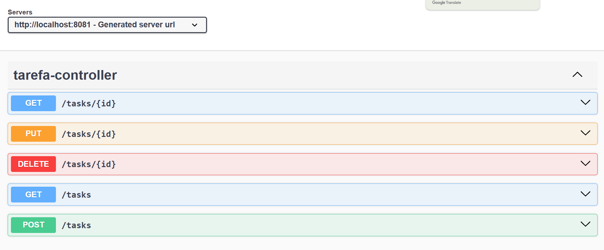
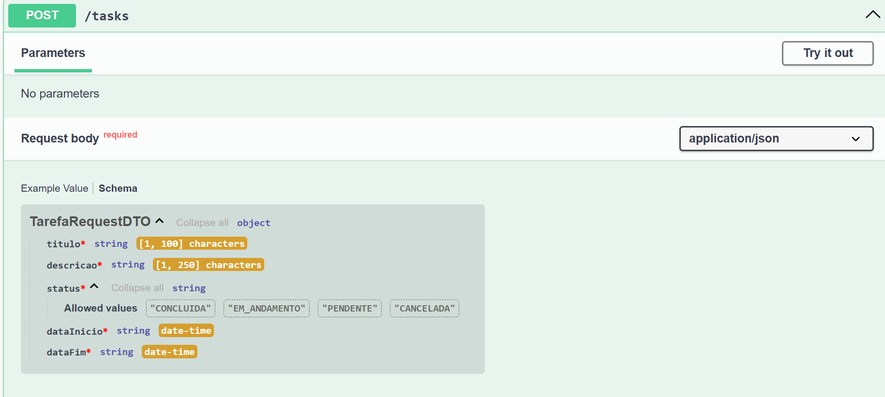
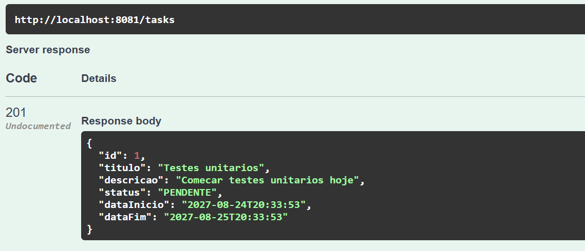

# 📋 Personal Tasks API

API RESTful desenvolvida com Spring Boot para gerenciamento de tarefas pessoais, focada em boas práticas de arquitetura em camadas, DTOs, validações com Bean Validation e tratamento global de exceções.

---

## 🛠️ Tecnologias Utilizadas

* **Java 21**
* **Spring Boot 3**
* **Spring Data JPA**
* **H2 Database**
* **Bean Validation** (`jakarta.validation`)
* **OpenAPI 3 / Swagger UI**
* **JUnit 5 & Mockito**

---

## 🏛️ Arquitetura do Sistema

A aplicação segue a divisão em camadas para separação clara de responsabilidades:

* **Controller:** Exposição dos endpoints REST e documentação via Swagger.
* **Service:** Regras de negócio e validações da aplicação.
* **Repository:** Consultas e persistência de dados.
* **DTOs (`Record`):** Transferência de dados com validações atreladas .
* **Exception Handler (`@ControllerAdvice`):** Tratamento e padronização centralizada de erros.

---

## 📌 Documentação Interativa (Swagger UI)

### 1. Visão Geral dos Endpoints


### 2. Contrato de Entrada e Validações (DTO Schema)


### 3. Exemplo de Resposta (201 Created)


---

## 🚀 Como Executar o Projeto Localmente

### Pré-requisitos
* **Java 21** instalado
* **Git** instalado

### Passo a Passo

1. **Clonar o repositório:**
   ```bash
   git clone [https://github.com/paulohscoelho/personal-tasks.git](https://github.com/paulohscoelho/personal-tasks.git)